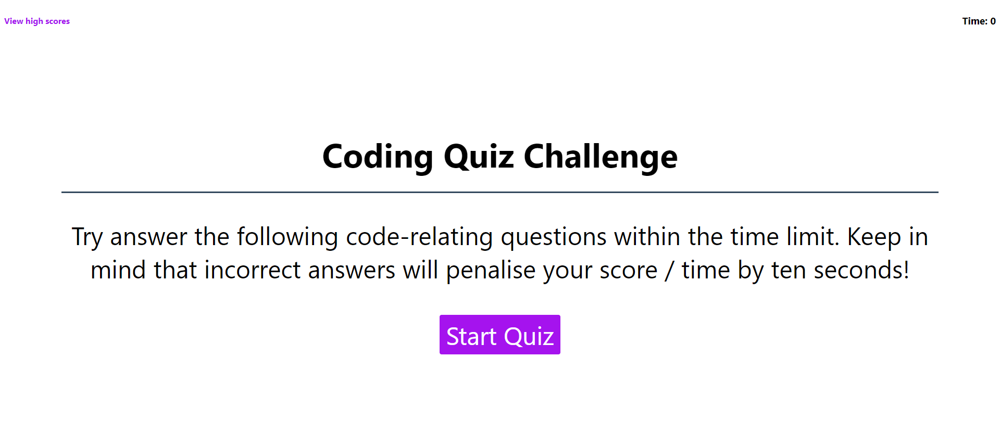

# Code Quiz

## Descrition

Code Quiz is a timed, multiple-choice coding quiz that captures the user input and tracks his scores along the way.

## Table of contents
<ul>
    <li>Screenshot</li>
    <li>User Story</li>
    <li>Acceptance criteria</li>
    <li>Technologies</li>
    <li>Installation</li>
    <li>Usage</li>
    <li>Documentation</li>
    <li>License</li>
    <li>Deployment</li>
    <li>Author</li>
</ul>
 

## Screenshot

 
 

## User Story
<pre>
As a coding boot camp student, 
I want to take a timed quiz on JavaScript fundamentals that stores high scores. 
In doing so, I can gauge my progress compared to my peers.
</pre>

## Acceptance Criteria
<li>GIVEN I am taking a code quiz.</li>
<li>WHEN I click the start button,</li>
<li>THEN a timer starts and I am presented with a question.</li>
<li>WHEN I answer a question,</li>
<li>THEN I am presented with another question.</li>
<li>WHEN I answer a question incorrectly,</li>
<li>THEN time is subtracted from the clock.</li>
<li>WHEN all questions are answered or the timer reaches 0,</li>
<li>THEN the game is over.</li>
<li>WHEN the game is over,</li>
<li>THEN I can save my initials and score.</li>
 

## Technologies 
<ul>
    <li>HTML 5</li>
    <li>CSS 3</li>
    <li>JavaScript ES5</li>
</ul>

## Installation
The user does not need to install any software.

## Usage
<pre>
The user can click on the start quiz button to launch the quiz. A timer will urge him to answer questions as quick as possible. 
</pre>
## Doumentation
<li>https://www.w3schools.com/</li>
<li>https://www.traversymedia.com/</li>
<li>https://developer.mozilla.org/en-US/</li>
<li>https://eloquentjavascript.net/</li>
 

## License
Code Quiz is under MIT License.

## Deployment
<ul>
    <li>Website: </li>
    <li>Repository: https://github.com/cedagbo/Code-Quiz </li>
</ul>

## Credit
Copyright (c) 2022 Chris-Eric Dagbo
